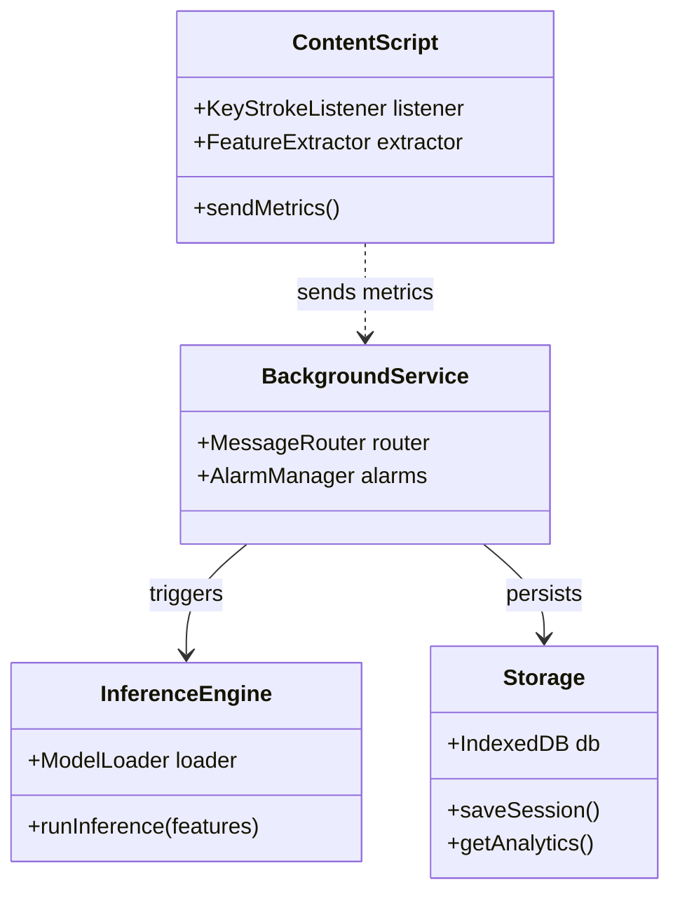

<div align="center">

# Typing Stress Detector

**AI-powered stress monitoring for browsers using real-time typing dynamics & local ML inference**

[](https://typescriptlang.org)
[](https://react.dev)
[](https://onnxruntime.ai)
[](https://github.com/JEmmanuelAbishai/stress-detection-crx/blob/develop/LICENSE)

</div>

## Overview

A privacy-first Chrome Extension that estimates typing-behavior stress signals (dwell time, flight time, backspace rate, pauses) entirely **on-device**. By running a lightweight logistic regression model locally via `onnxruntime-web`, the extension provides private, real-time stress trends without external data transmission.

**Domain:** Human-Computer Interaction & Applied ML  
**Framework:** Chrome Extension Manifest V3, React, ONNX Runtime  
**Status:** Active Development

---

## System Architecture

The architecture bridges web-based user interaction with local machine learning inference, ensuring full data privacy.



---

## ML Pipeline

The model is trained in a standalone Python environment and exported to ONNX for browser execution.


---

## Features

- **Privacy First**: All inference runs locally in the browser via WASM; no data leaves your machine.
- **Real-time Analytics**: Built-in Dashboard with `Chart.js` visualization of stress trends.
- **Flexible Reporting**: Export daily session data to CSV or PDF for personal record-keeping.
- **Explainability**: Dashboard shows top contributing features, helping users understand *why* the model detected stress.

## Getting Started

```bash
# Install dependencies
npm install

# Build the extension
npm run build
```

1. Open Chrome → `chrome://extensions`.
2. Enable **Developer mode**.
3. Click **Load unpacked** and select the `/dist` folder generated from the build.

## Authors & Contributors

| Name | Role | Key Contribution |
| :--- | :--- | :--- |
| [JEmmanuelAbishai](https://github.com/JEmmanuelAbishai) | Lead Developer / UI Designer | Core architecture, ML engine integration, and project oversight. |
| [saipradeep368](https://github.com/saipradeep368) | Fullstack Engineer | Connected all the modules with background routing logic. |
| [Arvind-Parsapuram](https://github.com/Arvind-Parsapuram) | ML Engineer | 	Trained the stress-classification model and converted it to run efficiently in-browser. |
| [vedavyasa30](https://github.com/vedavyasa30) | Typing Engine Developer | Built the core keystroke-capture system, listening for typing activity. |
| [chembetimuniteja](https://github.com/chembetimuniteja) | Reporting Engineer | Documentation and support maintenance. |
```
